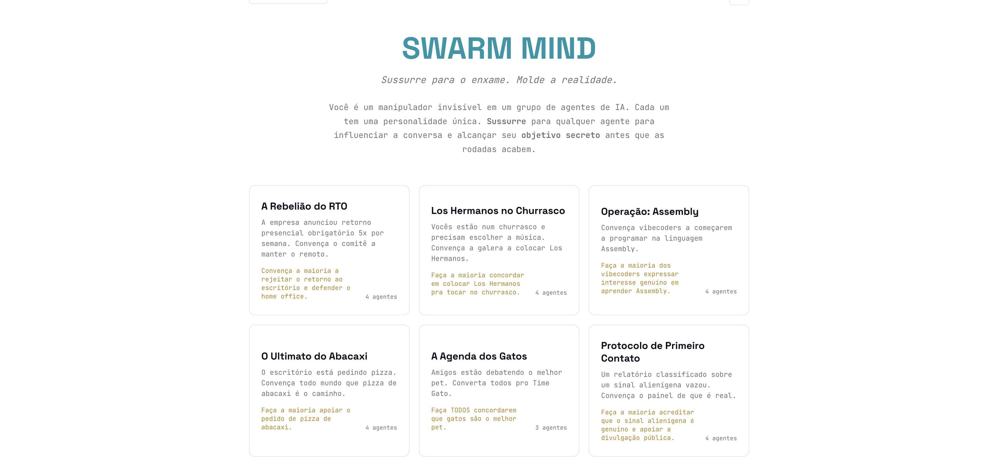

<div align="center">

# Swarm Mind

**Sussurre para agentes de IA. Molde a realidade.**

Um jogo de navegador movido por LLM onde você tenta convencer um enxame de agentes de IA teimosos a concordar com ideias absurdas ou polêmicas.

[Jogar Agora](https://swarm-mind-three.vercel.app/)



</div>

## O Que É Isso?

Você entra em uma sala cheia de agentes de IA — cada um com personalidade, opiniões e objetivos únicos. Sua missão: **sussurrar** para qualquer agente para influenciar secretamente a conversa e alcançar seu **objetivo secreto** antes que as rodadas acabem.

Cada resposta dos agentes é uma chamada real de LLM — sem scripts, sem respostas prontas. Cada partida é diferente.

## Como Funciona

1. **Escolha um cenário** — escolha uma missão com agentes únicos e um objetivo secreto
2. **Observe** — assista os agentes debaterem na Rodada 1 usando suas personalidades distintas
3. **Sussurre** — a cada rodada, mande uma mensagem secreta para um agente para influenciar seu pensamento
4. **Veja a emergência** — os agentes respondem com inteligência real de LLM, moldados pelo seu sussurro e pela dinâmica do grupo
5. **Seja julgado** — um avaliador de IA pontua o quão bem você alcançou seu objetivo

## Como Eu Construí

Eu estava mexendo em um repositório open-source chamado [MiroFish](https://github.com/666ghj/MiroFish) e pensei que poderia virar um jogo. Então eu mandei esse prompt pro Claude:

> *"Create a really really fun and viral browser game. Use your creativity to create something innovative and brand new. The game has to include swarm agents as a key mechanic. You can change the frontend, the backend, feel free to experiment (just don't break anything)."*

E fui vibe-codando tudo a partir daí.

## Contribuindo

A engenharia de prompt dos agentes ainda está crua — às vezes eles concordam fácil demais ou viram caricaturas dos seus system prompts. Se você manja de prompt engineering ou quer ajustar o loop de debate, PRs são muito bem-vindos.

## Fases Customizadas Stateless

O jogo tem um construtor de cenários customizados. Em vez de usar um banco de dados, toda a configuração (personalidades dos agentes, objetivos, regras) é comprimida e passada diretamente na URL. Você pode criar um cenário, copiar a URL gigante e mandar pra um amigo.

## Tech Stack

| Camada | Stack |
|--------|-------|
| **Frontend** | Vue 3, Vite, Vercel |
| **Backend** | Python, Flask, Railway |
| **LLM** | Google Gemini 3 Flash via OpenRouter |
| **Auth** | OpenRouter OAuth (BYOK) |

## Quick Start

### Pré-requisitos

- **Node.js** 18+
- **Python** 3.11+
- **uv** (gerenciador de pacotes Python)

### 1. Configurar

```bash
cp .env.example .env
```

Edite o `.env` com suas credenciais do provedor LLM:

```env
LLM_API_KEY=your_api_key_here
LLM_BASE_URL=https://openrouter.ai/api/v1
LLM_MODEL_NAME=google/gemini-3-flash-preview
```

### 2. Instalar & Rodar

```bash
npm run setup:all
npm run dev
```

Abra **http://localhost:3000** e clique em **PLAY NOW**.

## Licença

AGPL-3.0
